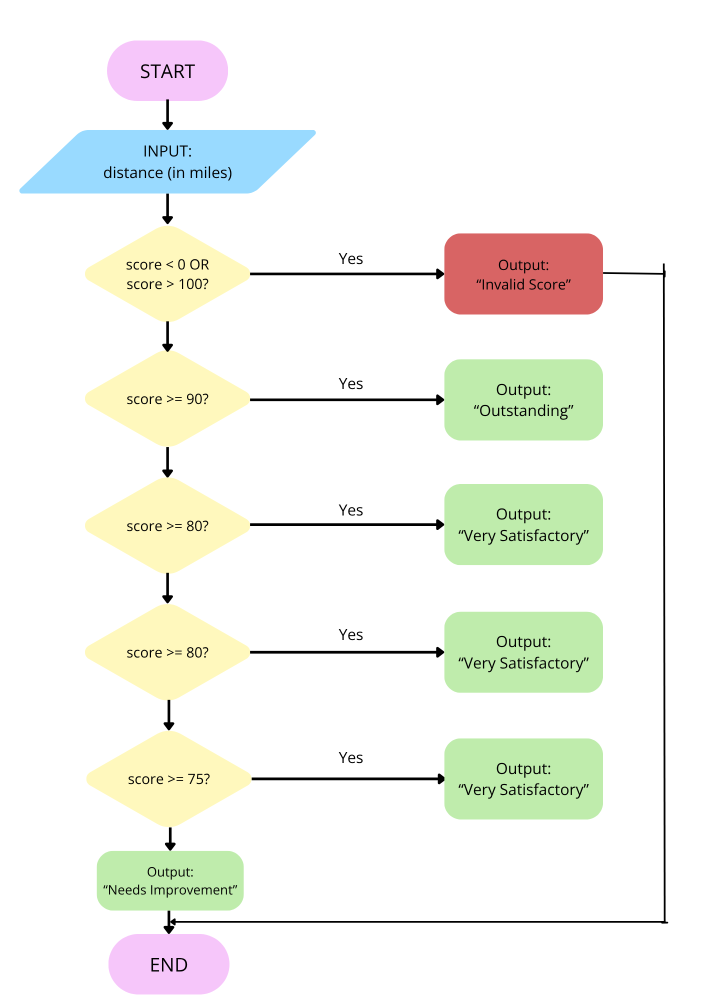

# Clean Decision Code Makeover: Student Score Checker
**Name:** Naomi Kristelle Mae L. Belleza

**Section:** Dahlia
---
## Activity Overview

In this activity, I improved a Student Score Checker program by making the code more readable, organized, and safe.
The program accepts a student score from 0 to 100 and determines its classification.

The classifications are:

| Score | Classification |
|---:|---|
| 90–100 | Outstanding |
| 80-89 | Very Satisfactory |
| 75-80 | Satisfactory |
| 0–74 | Needs Improvement |

Scores below 0 or above 100 are considered invalid.

# Part 1 - Analyze the Logic
## Input
What information does the program need?
> The program needs the student's score as input.

## Valid Range
**Minimum valid score:**
> 0
**Maximum valid score:**
> 100

## Possible Outputs
List all possible outputs of the program.
1. Outstanding
2. Very Satisfactory
3. Satisfactory
4. Needs Improvement
5. Invalid

## Boundary Condition
What condition will you use to determine whether the score is valid?
> The score is valid if it is between 0 and 100. Scores below or above the range are invalid.
>  
## Multiple Decision Paths
Explain how the program decides which classification should be displayed.
> The grade classification uses multiple decision paths because the program checks different score ranges using is, elif, and else.
---
# Part 2 - Flowchart
## Flowchart

---
# Part 3 - Pseudocode
START

INPUT score

IF score < 0 OR score > 100 THEN
  DISPLAY "Invalid score."
ELSE IF score >= 90 THEN
  DISPLAY "Outstanding"
ELSE IF score >= 80 THEN
  DISPLAY "Very Satisfactory"
ELSE IF score >= 75 THEN
  DISPLAY "Satisfactory"
ELSE
  DISPLAY "Needs improvement"
END IF

END
